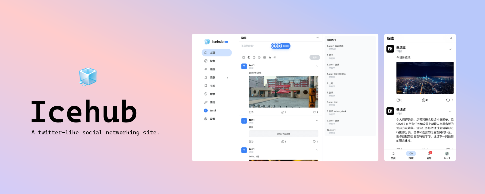

<div align="center">


# Icehub



[](https://github.com/Iceberry-qdd/icehub-frontend/actions/workflows/build.yml) [](https://github.com/Iceberry-qdd/icehub-frontend/actions/workflows/github-code-scanning/codeql)  

A social networking site. The repository is front-end repository.
</div>

## Instruction
Icehub (Iceberry's social hub) is a twitter-like social networking site I created. The front-end project uses [Vue](https://github.com/vuejs/core) as the development framework, with minimal use of other third-party libraries, and you can host it yourself if you wish.

> [!NOTE]
> This is the front-end, the back-end is currently not public (the code is not yet complete), you can browse the [online Demo](https://icehub.top).

## Feature

|feature|status|remark|
|---|:---:|---|
|Write post|<span style="background-color:#dafbe1;color:green;padding:0.2rem 0.5rem;border-radius:9999px;">DONE</span>||
|Write comment|<span style="background-color:#dafbe1;color:green;padding:0.2rem 0.5rem;border-radius:9999px;">DONE</span>||
|IM|<span style="background-color:#ffa50044;color:orange;padding:0.2rem 0.5rem;border-radius:9999px;">PLANNED</span>||
|Image upload|<span style="background-color:#dafbe1;color:green;padding:0.2rem 0.5rem;border-radius:9999px;">DONE</span>||
|Profile change|<span style="background-color:#dafbe1;color:green;padding:0.2rem 0.5rem;border-radius:9999px;">DONE</span>||
|Newest Emoji|<span style="background-color:#dafbe1;color:green;padding:0.2rem 0.5rem;border-radius:9999px;">DONE</span>||
|PWA|<span style="background-color:#dafbe1;color:green;padding:0.2rem 0.5rem;border-radius:9999px;">DONE</span>||
|Timed posting|<span style="background-color:#dafbe1;color:green;padding:0.2rem 0.5rem;border-radius:9999px;">DONE</span>||
|i18n|<span style="background-color:#ffa50044;color:orange;padding:0.2rem 0.5rem;border-radius:9999px;">PLANNED</span>|- [ ] #57|
|Dark mode|<span style="background-color:#dafbe1;color:green;padding:0.2rem 0.5rem;border-radius:9999px;">DONE</span>||


## Build
You can build from source code like this:

#### Install dependencies

```sh
npm install
```

#### Compile and Hot-Reload for Development

```sh
npm run dev
```

#### Compile and Minify for Production

```sh
npm run build
```

> [!NOTE]
> For production builds, create a new file called `.env.production` with the same contents as the [.env.development](./.env.development) file or configure the key-value pairs yourself.

## Contributors

<a href="https://github.com/Iceberry-qdd/icehub-frontend/graphs/contributors">
  
</a>

## Code of conduct
See [CODE_OF_CONDUCT.md](CODE_OF_CONDUCT.md)

## License
Licensed under the [MIT](LICENSE.txt) license.

## Star History
[](https://star-history.com/#Iceberry-qdd/icehub-frontend&Date)